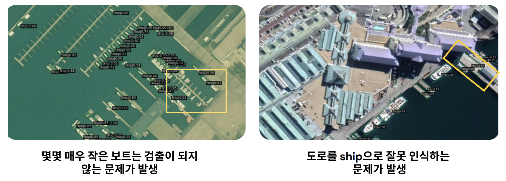

# Detection of Aircraft, Vehicles and Ships in Satellite imagery ::  Team 잘할거SIA

  

# ✅ Detection of Aircraft, Vehicles and Ships in Satellite imagery

## **🌈 잘할거SIA팀 구성 및 역할**
<table style = "width:100% !important; margin:0; border:0.5px solid #c1c1c1; font-size:15px;">
    <th style = "width:20%; padding:10px; text-align:center; border:0.5px solid #c1c1c1;">이름</th>
    <th style = "width:20%; padding:10px; text-align:center; border:0.5px solid #c1c1c1;">구성</th>
    <th style = "width:60%; padding:10px; text-align:center; border:0.5px solid #c1c1c1;">역할</th>
    <tr>
        <td style = "padding:10px; text-align:center; border:0.5px solid #c1c1c1;">차보경</td>
        <td style = "padding:10px; text-align:center; border:0.5px solid #c1c1c1;">팀장</td>
        <td style = "padding:10px; text-align:center; border:0.5px solid #c1c1c1;">프로젝트 진행 방향설정, Evaluation Matrix 개선, 모델 학습 및 분석</td>
    </tr>
    <tr>
        <td style = "padding:10px; text-align:center; border:0.5px solid #c1c1c1;">채준병</td>
        <td style = "padding:10px; text-align:center; border:0.5px solid #c1c1c1;">팀원</td>
        <td style = "padding:10px; text-align:center; border:0.5px solid #c1c1c1;">Dataset EDA, 모델 학습 및 분석, large image 처리</td>
    </tr>
    <tr>
        <td style = "padding:10px; text-align:center; border:0.5px solid #c1c1c1;">한연규</td>
        <td style = "padding:10px; text-align:center; border:0.5px solid #c1c1c1;">팀원</td>
        <td style = "padding:10px; text-align:center; border:0.5px solid #c1c1c1;">Dataset EDA, 모델 학습 및 분석</td>
    </tr>
    <tr>
        <td style = "padding:10px; text-align:center; border:0.5px solid #c1c1c1;">임새란</td>
        <td style = "padding:10px; text-align:center; border:0.5px solid #c1c1c1;">팀원</td>
        <td style = "padding:10px; text-align:center; border:0.5px solid #c1c1c1;">라이브러리 구현, 프로젝트 Base line 코드 취합, 모델 학습 및 분석</td>
    </tr>
    <tr>
        <td style = "padding:10px; text-align:center; border:0.5px solid #c1c1c1;">윤혜연</td>
        <td style = "padding:10px; text-align:center; border:0.5px solid #c1c1c1;">팀원</td>
        <td style = "padding:10px; text-align:center; border:0.5px solid #c1c1c1;">모델 결과 시각화 (QGIS 등), 모델 학습 및 분석</td>
    </tr>
</table>

## **1. 프로젝트 주제 및 문제정의**
### **1-1. 프로젝트 주제**
> 위성 영상에서의 객체(항공기, 선박, 차량) 를 탐지하기 위한 알고리즘 개발

위성영상에는 차량, 항공기, 선박 등 아주 다양한 객체가 포함되어 있습니다. 이러한 객체들을 사람의 눈으로 신속하고 정확하게 탐지하는 것은 매우 어려운 일입니다.  

이에 본 프로젝트에서는 **딥러닝 비전 기술을 이용하여 위성 영상에서의 객체(항공기, 선박, 차량)를 탐지하기 위한 알고리즘을 개발**하고자 합니다. 

### **1-2. 프로젝트 계획**

본 프로젝트에서 중요한 것은 **위성영상이 가진 특징을 고려한 객체탐지 알고리즘을 구축**하여야 한다는 것입니다. 

일반적으로 위성영상은 일반 영상에 비해 회전된 객체가 많다는 특징이 있습니다. 따라서 다양한 각도를 고려한 객체 탐지를 하는 것이 중요합니다.

뿐만 아니라 객체탐지 알고리즘의 성능은 데이터셋에 직접적인 영향을 받기 때문에 데이터셋의 자체의 특성(객체분포, 이미지 크기 등)을 고려한 알고리즘을 구축해야합니다.

따라서 본 프로젝트에서는 크게 **1) 다양한 각도에도 범용적으로 적용이 가능한 모델을 선정하는 작업**과  **2) 데이터셋 자체 특성에 맞게 모델을 튜닝 하는 작업** 두가지를 진행합니다. 

 
  
## **2. EDA**

데이터 특성을 고려한 모델을 구축하기 위해선 EDA 를 통해 데이터가 어떤 특성을 지니고 있는지 확인하는것이 중요합니다. EDA는 **이미지**(**Image**)와 **객체**(**Object**) 두가지 측면으로 나눠서 살펴보도록 하겠습니다. 

### 2-1. **Image**

- **이미지 사이즈 분포**

    

> 이미지 사이즈가 아주 다양하고, 대부분의 이미지의 해상도가 큰편입니다.  이미지 사이즈가 클 경우 학습에 어려움이 있기에 이미지를 분할하는것이 좋습니다. 

- **이미지 종횡비별 데이터수**

    
    > 대부분의 이미지 종횡비는 대부분 1:1, 3:4, 4:3 로 구성되어 있습니다. 1:1로 Random Crop한 후 padding 적용하는것이 좋아보입니다. 
    

### 2-2. Object
- **Class별 전체 Object 갯수**

    
    > Class 별로 Object 수가 존재함을 알 수 있습니다. 특히 Vehicle은 전체 Object의 80%를 차지하는데, 이러한 불균형은 성능 저하에 영향을 미치는 주요 요인이 될 수 있습니다. 또한 데이터 셋에는 검출해 내고자 하는 클래스 (Vehicle, Ship, Airplane) 외 클래스만 존재하는 데이터도 존재하는 것을 알 수 있는데, 이러한 데이터들을 학습시킬 때 제외 처리할지, 유지할지 고민해 보아야 합니다.
    
- 1 **Scene 당 Object 갯수 분포**

    
    > 이미지 1장에 포함된 Object 수가 1~4개인 이미지가 전체 비율에서 60%가량 차지함을 확인할 수 있습니다. 1Scene 당 최대 Object는 1075개까지 존재합니다.
    
- **Class별 Object Size 통계**
    
    
    
    > 클래스 내에서도 Object (bounding box) 면적이 아주 다양하게 분포하고 있습니다. 이를 확인해 보니 Labeling Noise 가 존재하는 것을 알 수 있습니다.
    

- **Class별 Object 종횡비 분포**
    
    
    
    > Object의 size, 종횡비 분포가 넓고 특히 Ship의 종횡비 분포가 0~ 12까지 넓게 분포해있는 것을 알 수 있습니다. 
    
    ### 2-3. 문제 해결 전략

    
    - **`Data Imbalance`**: Baseline model 로 학습을 진행한후 결과에 따라서 처리하도록 하겠습니다.
    - **`Train input시, Others 만 존재하는 image 처리`** : ‘Other 클래스만 존재하는 데이터 제외’ VS ‘유지‘로 비교 실험을 진행하도록 하겠습니다.
    - **`Scene 당 Object 분포가 제각각`** : Class 비율에 맞춰 데이터 샘플링을 진행하도록 하겠습니다.
    - **`이미지 해상도가 높은 편 (평균 1000, 최대 7000)`: 전처리로** multi split 또는 Random Resize 를 진행하도록 하겠습니다.
    
    ## 3. 문제해결 과정 1차 : Baseline 모델 학습  및 평가
    

    
    ### 3-1. 데이터 전처리
    

    
    EDA를 통해 도출해낸 문제점과 위성영상의 회전된 객체 탐지문제를 해결하기 위해 다음과 같은 세가지 전처리 과정을 데이터셋에 적용하였습니다. 
    
    - **`Resize`** : 이미지 사이즈가 크면 학습에 어려움이 있기때문에 EDA를 통해 확인한 이미지 사이즈와 종횡비 분포를 참고하여 이미지 사이즈를 1024*1024 로 조정하였습니다.
    - `**Crop**`: 다양한 ****사이즈로의
    - `**Flip**`: 다양한 각도에도 강건한 모델을 위해서 이미지를 랜덤하게 25%의 확률로 '수평', '수직', '대각선'  방향으로 회전을 적용하였습니다.
    - backbone : ResNet50 (Pre trained)
    - Neck : feature pyramid network (FPN)
    - Head :  RPN head and RoI Head
    - Epoch : 12 (1X)
    
    ### 3-2. ****Baseline Model 선정: Oriented Rcnn****
        
    객체탐지 (Object Detection) 알고리즘은 Localization을 수행하기 위해 Feature Map을 기반으로 Object가 존재하는 위치에 Bounding Box를 그립니다. 일반적인 Bounding Box는 이미지와 수평적인 직사각형(Horizontal Bounding Box) 형태를 많이 사용하나, 객체가 많이 밀집되어 있는 경우에는 Bounding Box가 겹치는 문제가 생기기도 합니다. 
    
    따라서 본 프로젝트에서는 이러한 문제를 해결하기 위해서 Rotated(Oriented) Bounding Box 를 지원하는 모델 중 단일 모델 중 성능이 가장 우수한 (Dota 데이터셋 기준) **Oriented RCNN**을 기본 모델로 사용하였습니다. 상세구조는 아래와 같습니다. 
    
    - backbone : ResNet50 (Pre trained)
    - Neck : feature pyramid network (FPN)
    - Head :  RPN head(OrientedRPNHead), RoI Head(RotatedShared2FCBBoxHead, RotatedSingleRoIExtractor)
    - Epoch : 12 (1X)
    
      
    
    ### 3-2. 데이터 전처리 + ****Baseline Model 평가****

    
    Class 별 평가지표(recall, AP, F1Scroe) 를 비교하니, EDA과정에서 우려했던 Vehicle의 Imbalance 영향은 없는 것으로 판단되었습니다.  좀 더 세밀한 모델 평가를 위해 
    Precision 지표를 추가해주도록 하겠습니다. 
    

## 4. 문제해결 과정 2차 : Other 클래스만 존재하는 데이터 제외 VS 유지 실험

### 4-1. 지표 해석

전처리와 모델은 그대로 데이터만 바꿔서 학습을 진행하였고 그 결과 Other 클래스만 존재하는 데이터를 유지하는것이 제외하는것보다 mAp,F1Score 값 모두 0.1 가량 높았습니다. 배경의  따라서 앞으로의 학습은  **Other 클래스만 존재하는 데이터를 유지**해서 진행하도록 하겠습니다. 

추가적으로 Other 클래스를 유지한 모델의 결과를 상세하게 확인해보니 Ship의 recall, Precision, ap 값이 다른 Class에비해 약 0.1 낮은 것을 확인 할 수 있었습니다. 

### 4-2. 테스트 결과 시각화

- **Vehicle**

    
- **Airplane**

    
- **Ship**

    

### 4-3.  ****모델 평가 & 문제 해결 전략 수립****

지표와 시각화 결과를 확인해본 결과 전반적으로 Ship 클래스에서 성능이 떨어지는 것을 볼 수 있었습니다. 앞서 EDA 에서 Ship 클래스의 Object 종횡비 분포가 타 Class보다 넓게 분포되어 있는것을 확인했었는데, 이러한 특징은  Anchor 생성시 종횡비 예측이 어려울 수 있기 때문에 아래와 같은 전략을 세웠습니다. 

- **`Anchor generator의 Ratio, Size 조절`**
- **`Anchor Free model (Rotated FCOS)진행`**

## 5. 문제해결 과정 3차 : Anchor Free 모델 학습  및 평가

### 5-1.  ********Anchor Free 모델 선정

**Oriented FCOS model**

### 5-1.  ********Anchor Free 모델  ****평가****

 1 Stage Model 특성상 기존 모델에 비해 Evaluation 값이 전체적으로 떨어지는 것을 볼 수 있습니다.  Anchor의 영향으로 Ship의 결과값이 떨어진다면 Anchor free 모델에선 비슷한 값이 나오길 원했으나, 여기서도 Ship이 특히 낮은것을 확인 할 수 있습니다. 따라서 해당 모델은 채택을 하지 않도록 합니다. 

## 6. 문제해결 과정 4차 : 기존 모델의 Anchor Generator 보완

### 6-1. ****Oriented Rcnn 모델 튜닝****

Anchor Generator 의 scale과 ratio 를 다양하게 변경하면서 모델 성능을 파악하였습니다. 

 ratio 를 선정하는 기준은 EDA에서 살펴봤던 Ship 클래스의 Object 종횡비 분포를 참고하여 [3,4,5] 로 선정을 하였습니다. 

### 6-2. ****Oriented Rcnn 모델 튜닝 결과 해석****

- **Ratio에 따른 결과 평가**

    

- **Ratio에 따른 결과 시각화**

- **Size에 따른 Ship 지표 비교**

- 기존 모델**과 튜닝한 모델 Evaluation 비교**

    

- **Size에 따른 시각화**

    

## 7. 문제해결 과정 5차 : Class Imbalance 해결

EDA에서 확인한 Class Imbalance 에도 잘 작동하는 모델을 구축하고자  더 보완하고자 샘플링을 진행하였습다. 

- **`Scene 당 Object 분포가 제각각`** : Class 비율에 맞춰 데이터 샘플링을 진행하도록 하겠습니다

    

## 8. 프로젝트 회고
<table style = "width:100% !important; margin:0; border:0.5px solid #c1c1c1; font-size:15px;">
    <th style = "width:30%; padding:10px; text-align:center; border:0.5px solid #c1c1c1;">이름</th>
    <th style = "width:70%; padding:10px; text-align:center; border:0.5px solid #c1c1c1;">회고</th>
    <tr>        
        <td style = "width:30%; padding:10px; text-align:center; border:0.5px solid #c1c1c1;">차보경</td>
        <td style = "width:70%; padding:10px; text-align:center; border:0.5px solid #c1c1c1;">anchor-based detector는 class의 종횡비의 분포가 다름에 따라 detection 정확도의 편차가 큰 편인 것으로 확인할 수 있었습니다. 그러므로 3가지 class를 모두 탐지하는 모델을 만들기보다는 vehicle, airplane, ship을 각각 detection 하는 모델을 만들고 이를 앙상블 하는 기법을 적용하고 싶습니다.</td>
    </tr>
    <tr>
        <td style = "width:30%; padding:10px; text-align:center; border:0.5px solid #c1c1c1;">채준병</td>
        <td style = "width:70%; padding:10px; text-align:center; border:0.5px solid #c1c1c1;">인공위성 이미지의 특성상 학습에 많은 자원이 필요하고 가용할 수 있는 vram이 작아 아쉬웠습니다. 차후 이미지의 patch, split을 다양하게 적용하여 원본과의 결괏값 차이를 확인해보고 싶습니다.</td>
    </tr>
    <tr>
        <td style = "width:30%; padding:10px; text-align:center; border:0.5px solid #c1c1c1;">한연규</td>
        <td style = "width:70%; padding:10px; text-align:center; border:0.5px solid #c1c1c1;">위성 영상 특성에 맞게 모델을 적용하는 법과 모델 개선 과정으로 논리적으로 해결하는 좋은 경험이였습니다.</td>
    </tr>
    <tr>
        <td style = "width:30%; padding:10px; text-align:center; border:0.5px solid #c1c1c1;">임새란</td>
        <td style = "width:70%; padding:10px; text-align:center; border:0.5px solid #c1c1c1;">라이브러리에서 제공하는 코드 외에 우리에게 필요한 코드를 추가하고 적용하는 경험을 할 수 있어 흥미로웠습니다. 프로젝트를 진행하며 팀원간 코드의 통일과 공유가 중요하다는 점을 느꼈습니다. 또한 시간이 너무 없어 더 많은 시도를 하지 못한점이 많이 아쉽습니다.</td>
    </tr>
    <tr>
        <td style = "width:30%; padding:10px; text-align:center; border:0.5px solid #c1c1c1;">윤혜연</td>
        <td style = "width:70%; padding:10px; text-align:center; border:0.5px solid #c1c1c1;">mAP와 같은 수치상의 변화보다는 시각화를 통해 훈련한 모델이 객체의 size나 ratio에 따른 영향을 잘 캐치할 수 있는지 확인하는 과정이 매우 중요하다는 점을 느꼈습니다.</td>
    </tr>
</table>
